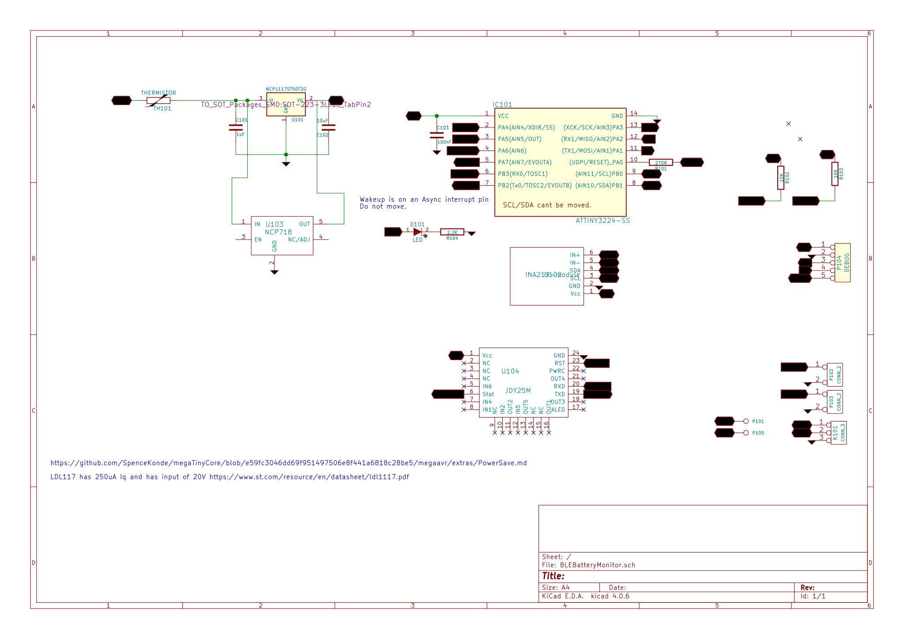
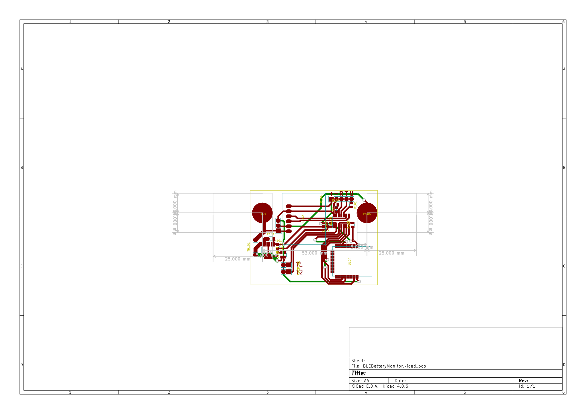

# BLEShunt

This is a Battery Shunt module that uses a JDY-25M to notifiy subscribing BLE Devices of current, voltage, power from 
a INA219 and 2 NTC temperature sensors. The BLE Device can be phones or ESP32's that are able to connect to the service
UUID and subscribe to the characteristics, both are non standard and statically defined inside the JDY-25M firmware.

The JDY-25M is normally in a light sleep consuming about 50uA, emitting advertisements every 3s. On connection the Attiny3224 wakes and starts emitting notifications of to the characteristic. During sleep the Attiny3225 and all other periperhals 
are put into deep sleep, hence the device should be capable of being permanently connected to 12V batteries as the draw is significantly less than the leackage current of the battery. This assumes the battery is > 50Ah.

Programming is via UDPI, using jtag2udpi although other prorammers can be used.

# JDY-25M

In mode 0 it operates as a transparent GATT Characteristic device with a fixed Service UUID, and characteristics. Writing to the serial porta results in devices that have connected and subsctibed to the characteristic being notified of each byte[] terminated by \r\n.

# INA219

Very simple to directly interact with over i2c. 1 config register, and 2 registers for raw voltage and raw shunt voltage. It is configured for 16V bus voltage, 12bit giving 4mv resplution, and 80mV shunt which gives  0.019mv per bit or 29mA/bit resolution. Stability appears rock solid.

# Attiny3224 sleep

The Attiny sleep is simple and allows putting the chip into deep sleep woken by a interrupt attached to the status pin of the JDY-25M. This goes high when a device connects, waking the device out of deep sleep.

In sleep the INS219 is also put to sleep, but the JDY-25 light sleeps consuming about 50uA and emtiting BLE advertisements. 

# Configuration

Configuring is done over the debug serial at 115200 baud, press h for menu. The name can be changed. 

# BLE

Service UUID is 0xFFE0, caracteristic is 0xFFE1 or 0xFFE2 supporting notify and write.

Data format uses int16 packed into a buffer 14 bytes long, big endian.

Bytes 0-1 Voltage  * 0.001 +- 32V.
Bytes 2-3 Current  * 0.01 +- 320A.
Bytes 4-5 Temperature 1 * 0.01 C +320C -273C
Bytes 6-7 Temperature 2 * 0.01 C +320C -273C
Bytes 8-9 On time in seconds
Bytes 10-11 error flag set bits indicates nature of the error.
   0x0001 == failed reading voltage.
   0x0002 == failed reading current.
   0x0004 == failed reading temp1.
   0x0008 == failed reading temp2.
Byte 12 == \r
Byte 13 == \n

# PCB

# Todo

* [x] Implement temperature sensors
* [ ] Build temperature sensors
* [ ] calibrate

